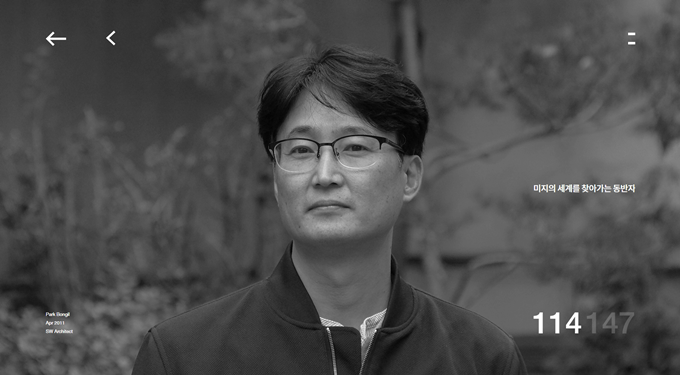

    

안녕하세요. 박봉일 입니다.

가장 쓸모있는 경험을 디자인하는 곳에서 백엔드개발을 담당하고 있습니다.  
빠르게 변화하는 IT가 즐겁습니다.

요즘의 관심분야는,
 - [Ubuntu Server](https://www.ubuntu.com/server)
 - [Spring Framework](https://spring.io/)
 - [Django Framework](https://www.djangoproject.com/)
 - [Raspberry Pi](https://www.raspberrypi.org/)
 - [Volumio](https://volumio.org/)
 - [Roon](https://roonlabs.com/)
 - FM Tuner
 - 아이사진

등이며 무엇보다 15살된 아들과 즐겁게 노는 것이 가장 행복합니다.

도움을 원하시거나 주실때는 bipark+blog{골뱅이}gmail{쩜}com으로 메일을 주시면 주말을 제외하고는 24시간 이내에 회신드리겠습니다. 혹시 급하시면 015-8515-6328로 호출바랍니다.